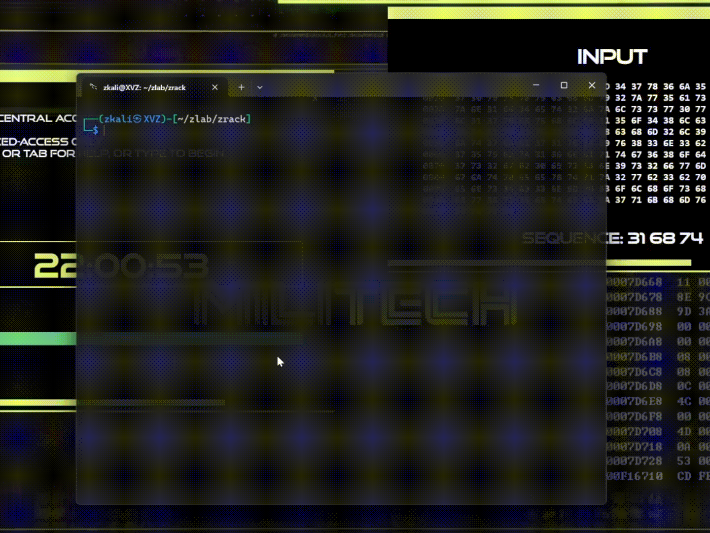

    ███████╗██████╗  █████╗  ██████╗██╗  ██╗
    ╚══███╔╝██╔══██╗██╔══██╗██╔════╝██║ ██╔╝
      ███╔╝ ██████╔╝███████║██║     █████╔╝ 
     ███╔╝  ██╔══██╗██╔══██║██║     ██╔═██╗ 
    ███████╗██║  ██║██║  ██║╚██████╗██║  ██╗
    ╚══════╝╚═╝  ╚═╝╚═╝  ╚═╝ ╚═════╝╚═╝  ╚═╝

    ▓▓▓  Z R A C K   S S H   D E C O N S T R U C T I O N   E N G I N E  ▓▓▓

    root@void:~# initializing entropy collapse...
    root@void:~# loading ssh2john module...
    root@void:~# dictionary weaponization ready...

ZRACK - SSH Passphrase Deconstruction Engine

ZRACK is a lightweight interactive Bash wrapper designed to automate SSH
private key passphrase auditing using John the Ripper (Jumbo Edition).

It extracts encrypted SSH key hashes via ssh2john, performs dictionary
attacks with john, and clearly displays recovered passphrases.

------------------------------------------------------------------------

⚠ Disclaimer

This tool is intended strictly for:

-   Authorized penetration testing
-   Security research
-   Red team lab environments
-   Personal SSH key strength auditing

Do NOT use this tool against systems or keys without explicit
authorization.

------------------------------------------------------------------------

🚀 Features

-   Interactive terminal interface
-   Underground hacker-style banner
-   TAB file auto-completion support
-   Automatic dependency check
-   Clean password extraction output
-   Temporary hash auto-cleanup
-   Compatible with large wordlists (100MB+)

------------------------------------------------------------------------

📦 Requirements

Before running ZRACK, ensure the following are installed:

1️⃣ Bash Shell

Most Linux distributions already include Bash.

Check version:

    bash --version

------------------------------------------------------------------------

2️⃣ John the Ripper (Jumbo Edition Recommended)

Install on Debian/Ubuntu:

    sudo apt update
    sudo apt install john

For full Jumbo version:

    git clone https://github.com/openwall/john.git
    cd john/src
    ./configure
    make -s clean && make -sj4

Ensure both commands below work:

    john --help
    ssh2john

------------------------------------------------------------------------

3️⃣ Wordlist

This project does **not** include large wordlists by default.

You are encouraged to use your own wordlists or obtain them from reputable open-source collections.

### 🔗 Recommended Source

One of the most trusted and widely used security wordlist repositories:

**SecLists by Daniel Miessler**  
https://github.com/danielmiessler/SecLists

SecLists provides high-quality, curated wordlists for:

- Password cracking
- SSH passphrase testing
- Web application security testing
- Red team and blue team assessments

### 🔎 Suggested Paths in SecLists

For SSH passphrase auditing, consider:

------------------------------------------------------------------------

🖥 Usage

Make script executable:

    chmod +x zrack.sh

Run:

    ./zrack.sh

Follow interactive prompts:

1)  Enter path to RSA private key file
2)  Enter path to wordlist file

TAB completion is supported when typing file paths.

------------------------------------------------------------------------

⚙ How It Works

1.  Extracts hash from encrypted SSH private key using:

    ssh2john <keyfile>

2.  Runs dictionary attack:

    john --wordlist=<wordlist> hashfile

3.  Displays cracked passphrase (if found):

    john --show hashfile

4.  Cleans temporary hash file automatically

------------------------------------------------------------------------

🛡 Security Insight

If your SSH key can be cracked using a 100MB dictionary:

-   Your passphrase lacks entropy
-   It follows predictable human patterns
-   It should be replaced immediately

Recommended strong passphrase format:

    Random-Word-Structure-91!Entropy

------------------------------------------------------------------------

📜 License

MIT License

Free to use, modify, distribute, and sell, provided license notice is
included.

------------------------------------------------------------------------

⭐ Support

If ZRACK helped you in your lab or assessment, consider giving the
repository a star.
